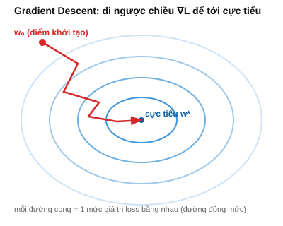

# Bài 11: Toán rời rạc, Độ phức tạp thuật toán & Tối ưu hóa lồi

## Mục tiêu
- Nắm tổ hợp/hoán vị, Big-O từ ý nghĩa, không chỉ công thức.
- Hiểu sâu 3 biến thể Gradient Descent — TẠI SAO chúng khác nhau về bản chất, trước khi cài đặt.

---

## PHẦN A — Ý NGHĨA TOÁN HỌC

### 1. Hoán vị & Tổ hợp — đếm "có phân biệt thứ tự" vs "không phân biệt thứ tự"

**Hoán vị:** số cách sắp xếp $n$ phần tử PHÂN BIỆT theo thứ tự. Lý luận đếm: vị trí đầu tiên có $n$ lựa chọn, vị trí thứ 2 còn $n-1$ lựa chọn (đã dùng 1), ..., vị trí cuối chỉ còn 1 lựa chọn → tổng số cách $=n\times(n-1)\times...\times1=n!$.

**Tổ hợp:** số cách CHỌN $k$ phần tử từ $n$, KHÔNG quan tâm thứ tự. Lý luận đếm: trước tiên đếm số cách chọn $k$ phần tử CÓ thứ tự (đó là $\frac{n!}{(n-k)!}$ — giống hoán vị nhưng dừng sau $k$ vị trí), sau đó chia cho $k!$ (số cách sắp xếp lại $k$ phần tử đã chọn, vì ta không phân biệt thứ tự nên mọi cách sắp xếp lại của cùng 1 tập hợp được coi là "1 lần đếm", nhưng công thức trên đã đếm nó $k!$ lần):

$$\binom{n}{k} = \frac{n!}{k!(n-k)!}$$

**Ví dụ tính tay:** chọn 3 người từ 5 người để lập đội (không phân vai trò) — $\binom{5}{3}=\frac{5!}{3!2!}=\frac{120}{6\times2}=10$ cách.

**Ứng dụng ML:** công thức Binomial ([Bài 9 mục 5](./9_probability_distributions.md)) dùng trực tiếp $\binom{n}{k}$ để đếm số cách sắp xếp $k$ "thành công" trong $n$ lần thử; k-fold cross-validation ([Bài 16](./16_model_evaluation.md)) liên quan tới cách CHIA dữ liệu thành các phần không trùng lặp.

### 2. Đồ thị — cấu trúc dữ liệu đứng sau nhiều mô hình ML

Đồ thị $G=(V,E)$ gồm đỉnh và cạnh nối chúng. Cây (tree) là đồ thị đặc biệt: liên thông, KHÔNG có chu trình (đi từ 1 đỉnh, không có đường nào quay lại chính nó mà không lặp cạnh) — đây chính xác là cấu trúc của **Decision Tree** ([Bài 18](./18_trees_ensembles.md)): mỗi node là 1 câu hỏi rẽ nhánh, không có "vòng lặp" quay lại câu hỏi đã hỏi. Bản thân mạng neural cũng là 1 đồ thị có hướng (**computational graph**) — mỗi phép toán là 1 node, cạnh biểu diễn luồng dữ liệu — đây chính là cấu trúc dữ liệu mà PyTorch/TensorFlow dùng nội bộ để tự động áp dụng chain rule ([Bài 6 mục 5](./6_calculus_matrix_calculus.md)) qua nhiều lớp (autograd).

### 3. Độ phức tạp thuật toán (Big-O) — áp dụng cho việc CHỌN thuật toán ML

Big-O mô tả tốc độ TĂNG của khối lượng tính toán khi kích thước dữ liệu tăng — không phải thời gian chạy tuyệt đối, mà là **xu hướng** khi $n$ (hoặc $m$) rất lớn.

| Thuật toán | Độ phức tạp | Ý nghĩa thực tế |
|---|---|---|
| Normal Equation ([Bài 3 mục 6](./3_linear_algebra_matrices.md)) | $O(n^3)$ (nghịch đảo $X^TX$) | Số đặc trưng $n$ tăng gấp đôi → tính toán tăng GẤP 8 LẦN — bùng nổ nhanh, không khả thi khi $n$ lớn (vd hàng nghìn đặc trưng ảnh) |
| Gradient Descent | $O(nm)$ mỗi bước | Tăng TUYẾN TÍNH theo cả $n$ và $m$ — chịu được $n$ lớn hơn nhiều |
| k-NN dự đoán ([Bài 19](./19_svm_knn_clustering.md)) | $O(m)$ mỗi truy vấn | Không "học" tham số, nhưng CHẬM DẦN khi dataset ($m$) lớn — mỗi dự đoán phải so sánh với TOÀN BỘ dữ liệu train |

**Đây chính là lý do toán học (không phải chỉ "kinh nghiệm") vì sao Deep Learning KHÔNG dùng Normal Equation** — mạng neural có thể có hàng triệu tham số ($n$ rất lớn), $O(n^3)$ trở nên hoàn toàn bất khả thi, buộc phải dùng Gradient Descent ($O(n)$ mỗi tham số mỗi bước).

### 4. Hàm lồi & Tập lồi — nhắc lại và hoàn thiện từ Bài 7

Tập $S$ **lồi**: đoạn thẳng nối 2 điểm bất kỳ trong $S$ vẫn nằm hoàn toàn trong $S$ — trực giác: "không có góc lõm/khuyết". Hàm $f$ lồi $\Leftrightarrow$ Hessian $\succeq0$ mọi nơi ([Bài 7 mục 2-3](./7_calculus_optimization.md)).

**Định lý nền tảng (đã chứng minh trực giác ở Bài 7, nhắc lại vì đây là ĐỘNG LỰC của toàn bộ phần tối ưu hóa):** với hàm lồi, MỌI điểm có $\nabla f=0$ là cực tiểu TOÀN CỤC — không có "bẫy" cực tiểu địa phương tồi. Đây là lý do "yên tâm" khi dùng Gradient Descent cho Linear/Logistic Regression (lồi), nhưng phải cẩn trọng hơn nhiều với Deep Learning (không lồi).

### 5. Gradient Descent — nhắc lại công thức, giờ tập trung vào 3 BIẾN THỂ

$$\vec{w}_{t+1} = \vec{w}_t - \eta\nabla L(\vec{w}_t)$$

đã chứng minh đầy đủ TẠI SAO công thức này làm giảm loss ở [Bài 7 mục 5](./7_calculus_optimization.md). Câu hỏi còn lại: **tính $\nabla L$ dựa trên BAO NHIÊU dữ liệu mỗi bước?** — đây là điểm khác biệt giữa 3 biến thể.

**Batch GD — dùng TOÀN BỘ $m$ mẫu mỗi bước:** $\nabla L=\frac{2}{m}X^T(X\vec{w}-\vec{y})$ (công thức đầy đủ, chính xác — [Bài 6 mục 3](./6_calculus_matrix_calculus.md)). Ưu điểm: gradient tính được là **chính xác tuyệt đối** theo định nghĩa hàm loss trên toàn dataset → đường hội tụ mượt, đúng lý thuyết ở [Bài 7 mục 5](./7_calculus_optimization.md). Nhược điểm: với $m$ rất lớn (hàng triệu mẫu), TÍNH GRADIENT MỘT LẦN đã cực kỳ tốn kém — chưa cập nhật được tham số nào cả.

**Stochastic GD (SGD) — dùng CHỈ 1 mẫu ngẫu nhiên mỗi bước:** gradient tính từ 1 mẫu chỉ là **ước lượng ngẫu nhiên (noisy estimate)** của gradient thật (gradient trung bình trên toàn dataset) — về mặt kỳ vọng, $E[\text{gradient 1 mẫu}] = \text{gradient thật}$ (tính chất tuyến tính của kỳ vọng — [Bài 9 mục 2](./9_probability_distributions.md), áp dụng cho trung bình gradient từng mẫu), nhưng MỖI lần cụ thể lại dao động mạnh quanh giá trị thật đó — đây là lý do đường hội tụ SGD "nhiễu", zig-zag thay vì mượt như Batch GD. Đổi lại, mỗi bước cực rẻ, có thể cập nhật hàng triệu lần nhanh chóng.

**Mini-batch GD — dùng $b$ mẫu ($1<b<m$) mỗi bước:** ước lượng gradient bằng trung bình của $b$ mẫu ngẫu nhiên — theo tính chất phương sai của trung bình mẫu ($\text{Var}(\bar{X})=\text{Var}(X)/b$, hệ quả trực tiếp từ [Bài 9 mục 3](./9_probability_distributions.md)), **độ nhiễu của ước lượng gradient giảm theo $1/\sqrt{b}$** khi $b$ tăng — đây là lý do TOÁN HỌC (không phải chỉ thực nghiệm) giải thích vì sao Mini-batch "mượt hơn" SGD nhưng vẫn "rẻ hơn nhiều" so với Batch GD: tăng $b$ giúp giảm nhiễu nhưng lợi ích giảm dần (do căn bậc 2), trong khi chi phí tính toán tăng TUYẾN TÍNH theo $b$ — đây chính là lý do các giá trị $b$ vừa phải (32, 64, 128...) thường là điểm cân bằng tốt trong thực tế Deep Learning ([Bài 20-22](./20_neural_networks.md)).

---

## PHẦN B — Cài đặt & Minh họa bằng code



```python
import numpy as np
from math import comb, perm

# Mục 1: verify tổ hợp/hoán vị
print(perm(5, 3))   # 60
print(comb(5, 3))    # 10 — khớp tính tay

# Mục 5: cài đặt cả 3 biến thể — verify chúng đều hội tụ về nghiệm gần giống nhau
def batch_gradient_descent(X, y, w_init, lr=0.01, n_iters=200):
	w = w_init.copy(); m = len(y)
	for _ in range(n_iters):
		grad = (2/m) * X.T @ (X @ w - y)  # dùng TOÀN BỘ m mẫu — gradient chính xác
		w = w - lr * grad
	return w

def stochastic_gradient_descent(X, y, w_init, lr=0.01, n_epochs=20):
	w = w_init.copy(); m = len(y)
	for _ in range(n_epochs):
		for i in np.random.permutation(m):
			xi, yi = X[i:i+1], y[i:i+1]
			grad = 2 * xi.T @ (xi @ w - yi)  # chỉ 1 mẫu — ước lượng NHIỄU của gradient thật
			w = w - lr * grad.flatten()
	return w

def minibatch_gradient_descent(X, y, w_init, lr=0.01, batch_size=32, n_epochs=50):
	w = w_init.copy(); m = len(y)
	for _ in range(n_epochs):
		indices = np.random.permutation(m)
		for start in range(0, m, batch_size):
			idx = indices[start:start+batch_size]
			Xb, yb = X[idx], y[idx]
			grad = (2/len(idx)) * Xb.T @ (Xb @ w - yb)  # trung bình b mẫu — nhiễu giảm theo 1/sqrt(b)
			w = w - lr * grad
	return w

np.random.seed(42)
m = 200
X = np.hstack([np.ones((m,1)), np.random.randn(m,1)*2])
true_w = np.array([3, 5])
y = X @ true_w + np.random.randn(m) * 0.5

w0 = np.zeros(2)
print("True w:", true_w)
print("Batch:", batch_gradient_descent(X, y, w0, lr=0.05, n_iters=200))
print("SGD:", stochastic_gradient_descent(X, y, w0, lr=0.01, n_epochs=20))
print("Mini-batch:", minibatch_gradient_descent(X, y, w0, lr=0.05, batch_size=32, n_epochs=50))
```

## Bài tập

1. **Tổ hợp ứng dụng**: tính tay số cách chia 20 mẫu dữ liệu thành 5-fold cross-validation (mỗi fold 4 mẫu, không lặp) — liên hệ [Bài 16](./16_model_evaluation.md).
2. **Kiểm tra hàm lồi**: dùng Hessian numerical ([Bài 7](./7_calculus_optimization.md)), verify $f(x)=x^2$ lồi và $f(x)=x^4-x^2$ KHÔNG lồi toàn cục (có vùng Hessian âm).
3. **So sánh độ nhiễu 3 biến thể**: chạy cả 3 hàm mẫu, lưu lại `loss` sau MỖI bước cập nhật (không chỉ kết quả cuối), vẽ đồ thị loss theo số bước (liên hệ [Bài 13](./13_data_visualization_eda.md)) — quan sát trực quan Batch mượt nhất, SGD nhiễu nhất, Mini-batch ở giữa.
4. **Verify lý thuyết "nhiễu giảm theo $1/\sqrt{b}$"**: với cùng dataset, chạy Mini-batch GD với `batch_size` = 4, 16, 64, đo độ lệch chuẩn của gradient ước lượng so với gradient thật (Batch) tại 1 điểm $\vec{w}$ cố định — verify độ lệch chuẩn giảm theo đúng tỷ lệ $1/\sqrt{b}$.

## Tổng kết Phần I — Toán Nền Tảng
Bạn đã hoàn thành 4 mảng toán cốt lõi với đầy đủ suy luận (không chỉ công thức): Đại số tuyến tính (dữ liệu & biến đổi không gian), Giải tích (cách model học qua gradient, chứng minh hội tụ), Xác suất & Thống kê (nguồn gốc MỌI hàm loss qua MLE/MAP), Toán rời rạc & Tối ưu hóa (thuật toán thực sự giải bài toán tối ưu). Từ đây, mọi công thức ở Phần II-III sẽ được giải thích bằng cách trỏ ngược lại các bài này.

## Tiếp theo
→ [Bài 12: NumPy & Pandas cho Data Science](./12_numpy_pandas.md)
