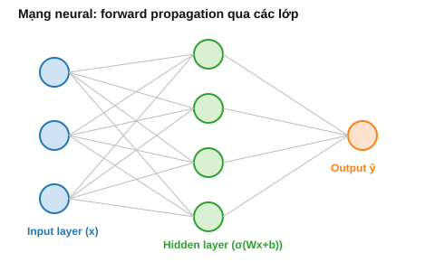

# Bài 20: Neural Network Cơ Bản — Perceptron & MLP

## Mục tiêu
- Hiểu neuron nhân tạo bắt nguồn từ đâu, ý nghĩa toán học của từng thành phần.
- Nắm forward propagation qua nhiều lớp — mọi công thức đều quy về những gì đã học ở Phần I.

---

## PHẦN A — Ý NGHĨA TOÁN HỌC

### 1. Perceptron — 1 neuron đơn giản chính là gì bạn đã biết

1 neuron nhân tạo tính: $z=\vec{w}^T\vec{x}+b$, rồi $a=\phi(z)$ (hàm kích hoạt). Nhìn kỹ: $\vec{w}^T\vec{x}$ chính là **dot product** ([Bài 2 mục 3](./2_linear_algebra_vectors.md)) — không có gì mới! Perceptron nguyên bản (Rosenblatt, 1958) chỉ là **Logistic Regression** ([Bài 15](./15_logistic_regression.md)) với hàm kích hoạt là hàm bậc thang (step function) thay vì sigmoid. Sự khác biệt của "mạng neural" so với các model tuyến tính đã học không nằm ở 1 neuron, mà ở việc **XẾP CHỒNG nhiều neuron thành nhiều lớp**.

### 2. Vì sao cần hàm kích hoạt PHI TUYẾN — chứng minh bằng đại số, không chỉ khẳng định

Giả sử KHÔNG dùng hàm kích hoạt phi tuyến (hoặc dùng hàm tuyến tính $\phi(z)=cz$). Xét mạng 2 lớp:

$$a = W_1\vec{x}+\vec{b_1}, \qquad \hat{y} = W_2a+\vec{b_2}$$

Thế $a$ vào: $\hat{y} = W_2(W_1\vec{x}+\vec{b_1})+\vec{b_2} = (W_2W_1)\vec{x} + (W_2\vec{b_1}+\vec{b_2})$

Đặt $W'=W_2W_1$ (tích 2 ma trận — vẫn là 1 ma trận, theo [Bài 3 mục 2](./3_linear_algebra_matrices.md)) và $\vec{b}'=W_2\vec{b_1}+\vec{b_2}$: $\hat{y}=W'\vec{x}+\vec{b}'$ — **DÙ có bao nhiêu lớp tuyến tính xếp chồng, kết quả cuối cùng vẫn chỉ là 1 phép biến đổi tuyến tính DUY NHẤT**, tương đương 1 lớp! Đây là chứng minh đại số nghiêm ngặt (không phải chỉ trực giác) cho việc: **không có hàm kích hoạt phi tuyến, mạng "sâu" bao nhiêu lớp cũng chỉ mạnh ngang Linear Regression** — hoàn toàn không học được các quan hệ phi tuyến (vd đường cong, ranh giới phân loại phức tạp).

### 3. Các hàm kích hoạt phổ biến — và lý do toán học chọn từng loại

**Sigmoid** $\sigma(z)=\frac{1}{1+e^{-z}}$ — đã học ở [Bài 15 mục 2](./15_logistic_regression.md), nén giá trị về $(0,1)$, đạo hàm đẹp $\sigma'(z)=\sigma(z)(1-\sigma(z))$. **Nhược điểm quan trọng:** khi $|z|$ lớn, $\sigma(z)$ gần 0 hoặc gần 1 → $\sigma'(z)$ gần 0 (nhìn đồ thị: 2 đầu hàm gần như "phẳng") — gradient truyền qua nhiều lớp bị nhân với những số gần 0 liên tiếp (chain rule — [Bài 6 mục 5](./6_calculus_matrix_calculus.md)), khiến gradient "tan biến" (**vanishing gradient**) ở các lớp đầu của mạng sâu.

**ReLU** $\text{ReLU}(z)=\max(0,z)$ — đạo hàm cực đơn giản: $1$ nếu $z>0$, $0$ nếu $z<0$ (không khả vi tại $z=0$, nhưng thực tế gán $=0$ hoặc $1$ tùy ước lệ, không gây vấn đề thực tế). Vì đạo hàm là $1$ (không "co nhỏ") với mọi $z>0$, gradient truyền qua nhiều lớp KHÔNG bị suy giảm theo cấp số nhân như sigmoid — đây là lý do ReLU là lựa chọn MẶC ĐỊNH cho mạng sâu hiện đại, giải quyết trực tiếp vấn đề vanishing gradient.

**Softmax** — mở rộng sigmoid cho $K$ lớp, dùng ở lớp cuối bài toán phân loại nhiều lớp: $P(y=k)=\frac{e^{z_k}}{\sum_je^{z_j}}$ (đã giới thiệu ở [Bài 15 mục 8](./15_logistic_regression.md)) — chuẩn hóa để tổng xác suất $=1$, một dạng tổng quát của Bernoulli sang phân phối Categorical.

### 4. Forward Propagation — chỉ là áp dụng lặp lại dot product + hàm kích hoạt

Với mạng $L$ lớp, forward propagation ở lớp $l$:

$$\vec{z}^{[l]} = W^{[l]}\vec{a}^{[l-1]}+\vec{b}^{[l]}, \qquad \vec{a}^{[l]} = \phi(\vec{z}^{[l]})$$

(với $\vec{a}^{[0]}=\vec{x}$ — input). Đây CHÍNH XÁC là phép nhân ma trận-vector ([Bài 3 mục 1-2](./3_linear_algebra_matrices.md)) áp dụng lặp lại: mỗi lớp "biến đổi không gian" của lớp trước, rồi "bẻ cong" bằng hàm kích hoạt phi tuyến (mục 2) — chuỗi các phép biến đổi tuyến tính xen kẽ phi tuyến này là điều cho phép mạng neural xấp xỉ được các hàm CỰC KỲ phức tạp (Universal Approximation Theorem — về mặt lý thuyết, mạng đủ rộng có thể xấp xỉ bất kỳ hàm liên tục nào).



### 5. Khởi tạo trọng số — vì sao KHÔNG khởi tạo bằng 0 hoặc số ngẫu nhiên bất kỳ

Nếu khởi tạo TOÀN BỘ $W=\vec{0}$: mọi neuron trong cùng 1 lớp tính ra CÙNG giá trị $z$ (vì cùng công thức, cùng input, cùng trọng số 0), nhận CÙNG gradient khi backprop ([Bài 21](./21_backpropagation.md)) — mọi neuron "học" giống hệt nhau mãi mãi, lãng phí hoàn toàn khả năng biểu diễn của việc có nhiều neuron (**symmetry problem**).

Nếu khởi tạo ngẫu nhiên nhưng phương sai QUÁ LỚN hoặc QUÁ NHỎ: $z=\vec{w}^T\vec{x}$ là tổng của $n$ số hạng (n = số input của neuron) — theo tính chất phương sai của tổng các biến độc lập ($\text{Var}(\sum X_i)=\sum\text{Var}(X_i)$ khi độc lập — hệ quả của [Bài 9 mục 4](./9_probability_distributions.md) khi covariance=0), phương sai của $z$ tỷ lệ thuận với $n\times\text{Var}(w)$ — nếu không điều chỉnh $\text{Var}(w)$ theo $n$, $z$ có thể "nổ" (quá lớn, bão hòa sigmoid ở vùng gradient≈0 — mục 3) hoặc "tắt" (quá nhỏ, mọi neuron gần như bằng nhau). **He initialization** ($\text{Var}(w)=2/n$, dùng với ReLU) và **Xavier initialization** ($\text{Var}(w)=1/n$, dùng với sigmoid/tanh) là các công thức khởi tạo ĐƯỢC THIẾT KẾ để giữ phương sai của $z$ ổn định qua các lớp — không phải "con số ma thuật" mà là hệ quả trực tiếp từ lý luận phương sai tổng vừa nêu.

---

## PHẦN B — Cài đặt & Minh họa bằng code

```python
import numpy as np

# Mục 2: verify bằng đại số — mạng "sâu" TUYẾN TÍNH tương đương 1 lớp
np.random.seed(42)
W1 = np.random.randn(4, 3); b1 = np.random.randn(4)
W2 = np.random.randn(2, 4); b2 = np.random.randn(2)
x = np.random.randn(3)

# Forward qua 2 lớp KHÔNG hàm kích hoạt phi tuyến
a = W1 @ x + b1
y_hat_2layers = W2 @ a + b2

# Tương đương 1 lớp DUY NHẤT với W' = W2W1, b' = W2*b1+b2
W_combined = W2 @ W1
b_combined = W2 @ b1 + b2
y_hat_1layer = W_combined @ x + b_combined

print(np.allclose(y_hat_2layers, y_hat_1layer))  # True — verify chứng minh mục 2

# Mục 3: hàm kích hoạt
def sigmoid(z): return 1 / (1 + np.exp(-z))
def relu(z): return np.maximum(0, z)
def softmax(z):
	exp_z = np.exp(z - np.max(z, axis=-1, keepdims=True))
	return exp_z / np.sum(exp_z, axis=-1, keepdims=True)

# Mục 4: forward propagation đầy đủ, có hàm kích hoạt phi tuyến
class SimpleMLP:
	def __init__(self, layer_sizes):
		self.W, self.b = [], []
		for i in range(len(layer_sizes) - 1):
			# He initialization — Var(w) = 2/n_in, khớp lý luận mục 5
			w = np.random.randn(layer_sizes[i+1], layer_sizes[i]) * np.sqrt(2 / layer_sizes[i])
			self.W.append(w)
			self.b.append(np.zeros(layer_sizes[i+1]))

	def forward(self, x):
		a = x
		for i in range(len(self.W) - 1):
			z = self.W[i] @ a + self.b[i]
			a = relu(z)                       # ReLU cho các lớp ẩn
		z_out = self.W[-1] @ a + self.b[-1]
		return softmax(z_out)                  # softmax cho lớp output (phân loại nhiều lớp)

mlp = SimpleMLP([4, 8, 6, 3])  # input 4 chiều -> 2 lớp ẩn -> output 3 lớp
x_sample = np.random.randn(4)
print(mlp.forward(x_sample))  # vector xác suất, tổng = 1
```

## Bài tập

1. **Verify chứng minh "mạng tuyến tính = 1 lớp"**: dùng code mẫu mục 2, thử với mạng 3 lớp thay vì 2, verify vẫn tương đương 1 phép biến đổi tuyến tính duy nhất.
2. **So sánh đạo hàm Sigmoid vs ReLU**: vẽ đồ thị $\sigma'(z)$ và $\text{ReLU}'(z)$ trên cùng 1 hình (liên hệ [Bài 13](./13_data_visualization_eda.md)), giải thích bằng lời tại sao vùng $|z|$ lớn của sigmoid là vấn đề cho mạng sâu.
3. **Cài đặt `SimpleMLP`**: dùng code mẫu trên làm nền, tự viết lại, thử forward với input batch (nhiều mẫu cùng lúc, dùng phép nhân ma trận thay vì vector đơn — liên hệ [Bài 3](./3_linear_algebra_matrices.md)).
4. **Thí nghiệm khởi tạo trọng số**: khởi tạo mạng với $\text{Var}(w)$ RẤT lớn (vd nhân thêm hệ số 10) và RẤT nhỏ (chia thêm 100), in ra giá trị $z$ ở lớp cuối cùng qua nhiều mẫu — quan sát hiện tượng "nổ"/"tắt" giá trị đúng như lý luận ở mục 5.

## Tiếp theo
→ [Bài 21: Backpropagation chi tiết (Toán + Code from scratch)](./21_backpropagation.md)
