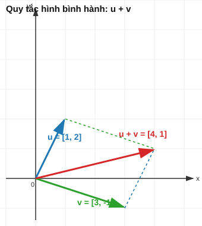
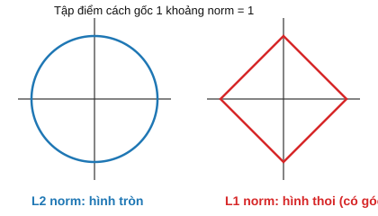

# Bài 2: Vector & Không gian vector

## Mục tiêu
- Hiểu bản chất và ý nghĩa hình học của vector, các phép toán trên vector.
- Nắm vững tích vô hướng, norm, góc giữa 2 vector — kèm lý do toán học đầy đủ, không chỉ công thức.
- Sau khi hiểu thấu ý nghĩa, mới cài đặt bằng NumPy và kết nối tới ML.

---

## PHẦN A — Ý NGHĨA TOÁN HỌC

### 1. Vector là gì? — 2 cách nhìn cần nắm cả hai

**Cách nhìn hình học:** vector là 1 mũi tên có **hướng** và **độ lớn**, xuất phát từ gốc tọa độ. Vector $\vec{v} = [3, 4]$ trong $\mathbb{R}^2$ là mũi tên đi từ điểm $(0,0)$ tới điểm $(3,4)$.

**Cách nhìn đại số:** vector là 1 danh sách $n$ số có thứ tự:

$$\vec{v} = \begin{bmatrix} v_1 \\ v_2 \\ \vdots \\ v_n \end{bmatrix} \in \mathbb{R}^n$$

Hai cách nhìn này **là một** — chỉ khác góc quan sát. Trong ML, ta hầu như luôn dùng cách nhìn đại số (vì dữ liệu có hàng chục/hàng nghìn chiều, không vẽ hình được), nhưng trực giác hình học ở $\mathbb{R}^2$/$\mathbb{R}^3$ vẫn đúng và giúp hiểu bản chất khi lên chiều cao hơn.

**Vì sao ML biểu diễn dữ liệu bằng vector?** Mỗi mẫu dữ liệu có nhiều thuộc tính (đặc trưng) — vd 1 căn nhà có diện tích, số phòng, tuổi nhà. Gộp $n$ con số đó thành 1 điểm duy nhất trong không gian $n$ chiều chính là định nghĩa của vector. Nhờ vậy, "1 căn nhà" trở thành "1 điểm hình học" — và mọi công cụ hình học (khoảng cách, góc, hình chiếu...) đều áp dụng được lên dữ liệu.

### 2. Phép cộng vector & nhân vô hướng — ý nghĩa hình học

**Cộng vector** $\vec{u} + \vec{v}$: đặt đuôi mũi tên $\vec{v}$ vào đầu mũi tên $\vec{u}$, vector tổng là mũi tên nối từ gốc tới điểm cuối cùng (quy tắc hình bình hành). Về đại số, chỉ đơn giản là cộng từng thành phần:

$$\vec{u} + \vec{v} = \begin{bmatrix} u_1+v_1 \\ u_2+v_2 \\ u_3+v_3 \end{bmatrix}$$

**Nhân vô hướng** $c\vec{u}$: giữ nguyên hướng (nếu $c>0$) hoặc đảo ngược hướng (nếu $c<0$), kéo dài/thu ngắn độ lớn theo hệ số $|c|$:

$$c\vec{u} = \begin{bmatrix} cu_1 \\ cu_2 \\ cu_3 \end{bmatrix}$$



**Ví dụ tính tay:** $\vec{u}=[1,2]$, $\vec{v}=[3,-1]$. $\vec{u}+\vec{v} = [4,1]$. $2\vec{u} = [2,4]$ — cùng hướng với $\vec{u}$ nhưng dài gấp đôi. Vẽ 3 mũi tên này ra giấy để thấy rõ quy tắc hình bình hành.

### 3. Tích vô hướng (Dot Product) — phép toán quan trọng nhất, và TẠI SAO

$$\vec{u} \cdot \vec{v} = \sum_{i=1}^n u_i v_i = u_1v_1 + u_2v_2 + \dots + u_nv_n$$

Đây là 1 con số (không phải vector) — đo **mức độ 2 vector "cùng hướng" với nhau đến đâu**. Để thấy rõ ý nghĩa này, ta cần liên hệ nó với góc giữa 2 vector (chứng minh ở mục 5):

$$\vec{u} \cdot \vec{v} = \|\vec{u}\|\|\vec{v}\|\cos\theta$$

Từ công thức này suy ra trực giác:
- $\vec{u}\cdot\vec{v} > 0$: góc giữa chúng nhọn ($\theta < 90°$) — 2 vector "cùng chiều" tương đối.
- $\vec{u}\cdot\vec{v} = 0$: góc vuông ($\theta = 90°$) — 2 vector **trực giao (vuông góc)**, hoàn toàn không liên quan hướng.
- $\vec{u}\cdot\vec{v} < 0$: góc tù ($\theta > 90°$) — 2 vector "ngược chiều" tương đối.

**Ví dụ tính tay:** $\vec{u}=[1,2,3]$, $\vec{v}=[4,5,6]$. $\vec{u}\cdot\vec{v} = 1\times4 + 2\times5 + 3\times6 = 4+10+18 = 32$.

**Vì sao dot product là phép toán "quan trọng nhất" của ML?** Vì dự đoán của MỘT SỐ RẤT LỚN thuật toán ML (Linear Regression, Logistic Regression, mỗi neuron trong mạng neural, SVM tuyến tính) đều có dạng $\vec{w}\cdot\vec{x}$ — đo mức độ "khớp" giữa vector đặc trưng $\vec{x}$ và vector trọng số $\vec{w}$ mà model đã học. Hiểu bản chất hình học của dot product (đo độ "cùng hướng") giúp hiểu tại sao model lại "phản ứng mạnh" với 1 số đặc trưng và "phớt lờ" đặc trưng khác — trọng số $w_i$ lớn nghĩa là model coi trục đặc trưng đó quan trọng.

### 4. Norm — "độ dài" của vector, và các biến thể của nó

**Euclidean norm (L2 norm)** — độ dài mũi tên theo định lý Pythagoras mở rộng cho $n$ chiều:

$$\|\vec{v}\|_2 = \sqrt{v_1^2 + v_2^2 + \dots + v_n^2} = \sqrt{\vec{v}\cdot\vec{v}}$$

Ghi chú: $\|\vec{v}\|_2^2 = \vec{v}\cdot\vec{v}$ — norm bình phương chính là dot product của vector với chính nó, đây là lý do 2 khái niệm (dot product và norm) liên hệ chặt với nhau.

**Ví dụ tính tay:** $\vec{v}=[3,4]$. $\|\vec{v}\|_2 = \sqrt{9+16} = \sqrt{25} = 5$ — đúng bằng cạnh huyền tam giác vuông 3-4-5.

**L1 norm** — tổng trị tuyệt đối các thành phần, KHÔNG phải "độ dài đường thẳng" mà là "khoảng cách đi theo lưới ô vuông" (city block/Manhattan distance):

$$\|\vec{v}\|_1 = |v_1| + |v_2| + \dots + |v_n|$$

**Trực giác hình học khác biệt then chốt giữa L1 và L2:** tập hợp các điểm cách gốc tọa độ 1 khoảng L2-norm bằng nhau tạo thành **hình tròn** (đường cong trơn), còn tập hợp các điểm cách gốc 1 khoảng L1-norm bằng nhau tạo thành **hình thoi** (có góc nhọn tại các trục). Chính "góc nhọn" này của L1 là lý do Lasso Regression ([Bài 17](./17_regularization.md)) đẩy được trọng số về CHÍNH XÁC 0 — nghiệm tối ưu có xu hướng "mắc" vào góc nhọn nằm trên trục tọa độ.



### 5. Khoảng cách Euclidean — chứng minh liên hệ với dot product & góc

Khoảng cách giữa 2 điểm (2 vector) — áp dụng norm lên vector hiệu:

$$d(\vec{u},\vec{v}) = \|\vec{u}-\vec{v}\|_2 = \sqrt{\sum_{i=1}^n(u_i-v_i)^2}$$

**Chứng minh công thức góc $\vec{u}\cdot\vec{v}=\|\vec{u}\|\|\vec{v}\|\cos\theta$** (định lý cos mở rộng): xét tam giác tạo bởi $\vec{u}$, $\vec{v}$, và $\vec{u}-\vec{v}$. Theo định lý cos trong tam giác:

$$\|\vec{u}-\vec{v}\|^2 = \|\vec{u}\|^2 + \|\vec{v}\|^2 - 2\|\vec{u}\|\|\vec{v}\|\cos\theta$$

Mặt khác, khai triển vế trái bằng đại số: $\|\vec{u}-\vec{v}\|^2 = (\vec{u}-\vec{v})\cdot(\vec{u}-\vec{v}) = \|\vec{u}\|^2 - 2\vec{u}\cdot\vec{v} + \|\vec{v}\|^2$.

So sánh 2 vế: $-2\vec{u}\cdot\vec{v} = -2\|\vec{u}\|\|\vec{v}\|\cos\theta \Rightarrow \vec{u}\cdot\vec{v} = \|\vec{u}\|\|\vec{v}\|\cos\theta$ — đây chính là công thức đã dùng ở mục 3, giờ đã thấy rõ nó đến từ đâu (định lý cos quen thuộc từ hình học phổ thông).

### 6. Cosine Similarity — chuẩn hóa dot product để chỉ đo HƯỚNG, bỏ qua độ lớn

Từ công thức góc, suy ra trực tiếp:

$$\cos\theta = \frac{\vec{u}\cdot\vec{v}}{\|\vec{u}\|\|\vec{v}\|}$$

**Vì sao cần "chuẩn hóa" dot product?** Dot product thô bị ảnh hưởng bởi cả độ lớn ($\|\vec{u}\|, \|\vec{v}\|$) lẫn hướng — 2 vector cùng hướng hệt nhau nhưng 1 cái "dài" hơn sẽ cho dot product lớn hơn, dù về bản chất chúng "giống nhau" hoàn toàn. Chia cho $\|\vec{u}\|\|\vec{v}\|$ loại bỏ ảnh hưởng độ lớn, chỉ còn lại thước đo thuần túy về **hướng**, luôn nằm trong $[-1, 1]$.

**Ứng dụng:** so sánh 2 văn bản (biểu diễn dạng vector tần suất từ) — 1 văn bản dài lặp lại từ nhiều lần sẽ có vector "dài hơn" nhưng nếu tỷ lệ từ giống nhau thì cosine similarity vẫn cao, phản ánh đúng "2 văn bản nói về cùng chủ đề" bất kể độ dài khác nhau.

### 7. Vector độc lập tuyến tính — trực giác

Vector $\vec{v_2}$ **phụ thuộc tuyến tính** vào $\vec{v_1}$ nếu $\vec{v_2} = c\vec{v_1}$ với 1 hằng số $c$ nào đó — nghĩa là chúng **cùng nằm trên 1 đường thẳng** qua gốc tọa độ, không mang thêm thông tin "hướng mới" nào. Tổng quát hơn, tập $\{\vec{v_1},...,\vec{v_k}\}$ **độc lập tuyến tính** nếu không vector nào trong tập biểu diễn được bằng tổ hợp tuyến tính của các vector còn lại — mỗi vector đóng góp 1 "hướng" thực sự mới.

**Ý nghĩa thực tế trong dữ liệu:** nếu cột "diện tích tính bằng m²" và cột "diện tích tính bằng ft²" cùng xuất hiện trong dataset, chúng phụ thuộc tuyến tính (chỉ khác hệ số nhân ~10.76) — về mặt thông tin, đó là CÙNG MỘT trục dữ liệu được lặp lại 2 lần. Vấn đề này (gọi là **multicollinearity**) gây khó khăn cho Linear Regression ([Bài 3 mục 7](./3_linear_algebra_matrices.md), [Bài 14](./14_linear_regression.md)) vì hệ phương trình xác định trọng số trở nên "mơ hồ" — có vô số cách chia trọng số giữa 2 cột phụ thuộc mà vẫn cho cùng 1 dự đoán.

---

## PHẦN B — Cài đặt & Minh họa bằng code

Sau khi đã nắm ý nghĩa toán học ở Phần A, phần này chỉ dùng NumPy để **verify lại** các công thức và tính chất đã học — không giới thiệu khái niệm mới.

```python
import numpy as np

# Mục 2: cộng vector, nhân vô hướng
u = np.array([1, 2])
v = np.array([3, -1])
print("u + v =", u + v)     # [4 1] — khớp tính tay
print("2u =", 2 * u)          # [2 4]

# Mục 3: dot product
u2 = np.array([1, 2, 3])
v2 = np.array([4, 5, 6])
print("u2 . v2 =", np.dot(u2, v2))  # 32 — khớp tính tay

# Mục 4: norm
v3 = np.array([3, 4])
print("L2 norm:", np.linalg.norm(v3))            # 5.0
print("L1 norm:", np.linalg.norm(v3, ord=1))       # 7.0

# Mục 5: khoảng cách Euclidean
a = np.array([1, 2])
b = np.array([4, 6])
print("Khoảng cách:", np.linalg.norm(a - b))  # 5.0

# Mục 6: cosine similarity
def cosine_similarity(u, v):
	return np.dot(u, v) / (np.linalg.norm(u) * np.linalg.norm(v))

print("cos(u, v):", cosine_similarity(np.array([1,0]), np.array([1,1])))  # ~0.707 = cos(45°)
```

**Ứng dụng ML trực tiếp** (xem chi tiết đầy đủ ở bài tương ứng):
- Dot product $\vec{w}\cdot\vec{x}$ = lõi của Linear Regression ([Bài 14](./14_linear_regression.md)), Logistic Regression ([Bài 15](./15_logistic_regression.md)), và mỗi neuron trong mạng neural ([Bài 20](./20_neural_networks.md)).
- Euclidean distance = nền tảng của k-NN và k-Means ([Bài 19](./19_svm_knn_clustering.md)).
- Cosine similarity = đo độ giống nhau trong recommendation system, NLP embeddings.
- L1/L2 norm = nền tảng của Lasso/Ridge Regression ([Bài 17](./17_regularization.md)).

```python
def most_similar(target, candidates):
	"""Mô phỏng bài toán recommendation đơn giản bằng cosine similarity."""
	sims = [cosine_similarity(target, c) for c in candidates]
	return candidates[np.argmax(sims)], max(sims)
```

## Bài tập

1. **Cộng/nhân vector bằng tay**: vẽ trên giấy 2 vector $\vec{u}=[2,1]$, $\vec{v}=[-1,2]$, dùng quy tắc hình bình hành để vẽ $\vec{u}+\vec{v}$, sau đó tính bằng đại số và verify bằng NumPy.
2. **Chứng minh lại công thức góc**: tự làm lại phép chứng minh ở mục 5 với 1 ví dụ số cụ thể — chọn $\vec{u}=[1,0]$, $\vec{v}=[1,1]$, tính $\theta$ bằng cả 2 cách (định lý cos và công thức dot product), xác nhận cùng kết quả 45°.
3. **Norm & khoảng cách**: tính bằng tay L1 norm, L2 norm của $[3,-4,12]$; giải thích bằng lời tại sao "hình dạng" bộ các điểm cách đều gốc tọa độ theo L1 norm là hình thoi chứ không phải hình tròn.
4. **Cosine similarity ứng dụng**: viết hàm `most_similar` như trên, thử với 1 vector "mục tiêu" và 3-4 vector "ứng viên" tự chọn, giải thích bằng lời tại sao kết quả trả về hợp lý dựa trên hướng của các vector.

## Tiếp theo
→ [Bài 3: Ma trận & Hệ phương trình tuyến tính](./3_linear_algebra_matrices.md)
