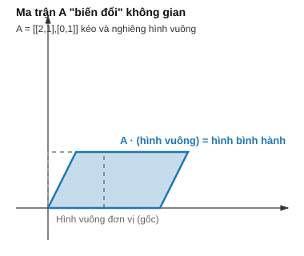

# Bài 3: Ma trận & Hệ phương trình tuyến tính

## Mục tiêu
- Hiểu bản chất ma trận như 1 **phép biến đổi không gian**, không chỉ là "bảng số".
- Nắm vững phép nhân ma trận, nghịch đảo, định thức — kèm ý nghĩa hình học.
- Giải hệ phương trình tuyến tính, hiểu vì sao Normal Equation của Linear Regression hoạt động.

---

## PHẦN A — Ý NGHĨA TOÁN HỌC

### 1. Ma trận là gì? — 2 cách nhìn

**Cách nhìn "bảng số":** ma trận $A \in \mathbb{R}^{m\times n}$ là bảng chữ nhật $m$ dòng, $n$ cột:

$$A = \begin{bmatrix} a_{11} & \dots & a_{1n} \\ \vdots & \ddots & \vdots \\ a_{m1} & \dots & a_{mn} \end{bmatrix}$$

**Cách nhìn "phép biến đổi" (quan trọng hơn nhiều để hiểu bản chất):** ma trận vuông $A$ là 1 **hàm số** nhận vector đầu vào, trả về vector đầu ra: $\vec{y} = A\vec{x}$. Áp dụng $A$ lên MỌI điểm trong không gian sẽ "kéo, xoay, nén, phản chiếu" toàn bộ không gian đó theo 1 quy luật nhất quán — hình vuông có thể biến thành hình bình hành, đường tròn có thể biến thành elip.



Ví dụ minh họa: $A = \begin{bmatrix}2&1\\0&1\end{bmatrix}$ biến hình vuông đơn vị thành hình bình hành — cột thứ nhất của $A$ ($[2,0]$) chính là nơi vector đơn vị $[1,0]$ "bị đưa tới", cột thứ hai ($[1,1]$) là nơi $[0,1]$ "bị đưa tới". **Đây là chìa khóa để đọc hiểu bất kỳ ma trận nào: mỗi CỘT của ma trận cho biết trục tọa độ gốc tương ứng bị biến đổi tới đâu.**

**Trong ML:** dataset là 1 ma trận **design matrix** $X \in \mathbb{R}^{m\times n}$ ($m$ mẫu, $n$ đặc trưng — mỗi DÒNG là 1 vector dữ liệu như ở [Bài 2](./2_linear_algebra_vectors.md)). Khi model tính $X\vec{w}$, về bản chất nó đang "chiếu" mỗi điểm dữ liệu $n$ chiều xuống 1 con số duy nhất theo 1 hướng nhất định trong không gian đặc trưng — chính là dot product của từng dòng với $\vec{w}$.

### 2. Phép nhân ma trận — vì sao định nghĩa "kỳ lạ" như vậy?

$$C = AB \quad\text{với}\quad C_{ij} = \sum_{k=1}^n A_{ik}B_{kj}$$

Định nghĩa này **không tùy tiện** — nó xuất phát từ yêu cầu: "áp dụng biến đổi $B$ trước, rồi áp dụng $A$" phải TƯƠNG ĐƯƠNG với "áp dụng 1 biến đổi duy nhất $AB$". Tức là $A(B\vec{x}) = (AB)\vec{x}$ với MỌI $\vec{x}$ — phép nhân ma trận chính là công thức duy nhất thỏa mãn tính chất "hợp thành phép biến đổi" (composition) này. Mỗi phần tử $C_{ij}$ chẳng qua là **dot product** ([Bài 2 mục 3](./2_linear_algebra_vectors.md)) giữa dòng $i$ của $A$ và cột $j$ của $B$ — bạn đã biết công thức này rồi, chỉ áp dụng lặp lại cho mọi cặp (dòng, cột).

**Ví dụ tính tay:** $A=\begin{bmatrix}1&2\\3&4\end{bmatrix}$, $B=\begin{bmatrix}5&6\\7&8\end{bmatrix}$.
$$C_{11} = 1\times5+2\times7=19,\quad C_{12}=1\times6+2\times8=22$$
$$C_{21} = 3\times5+4\times7=43,\quad C_{22}=3\times6+4\times8=50$$
Vậy $AB = \begin{bmatrix}19&22\\43&50\end{bmatrix}$.

**Điều kiện & ý nghĩa kích thước:** $A_{m\times n} \cdot B_{n\times p} = C_{m\times p}$ — số cột $A$ phải khớp số dòng $B$ vì đó chính là "chiều không gian trung gian" mà biến đổi $B$ đưa dữ liệu vào, rồi $A$ tiếp tục biến đổi từ đó.

**Vì sao $AB \neq BA$ nói chung?** Vì "xoay rồi kéo dãn" khác với "kéo dãn rồi xoay" — thứ tự áp dụng phép biến đổi quan trọng, giống hệt việc mặc áo trước quần khác với mặc quần trước áo cho ra kết quả khác nhau về mặt hình học.

### 3. Ma trận đơn vị & Ma trận nghịch đảo — ý nghĩa "phép biến đổi ngược"

Ma trận đơn vị $I$ là phép biến đổi "không làm gì cả" ($I\vec{x}=\vec{x}$ với mọi $\vec{x}$). Ma trận nghịch đảo $A^{-1}$ là phép biến đổi **hoàn tác chính xác** những gì $A$ đã làm:

$$A^{-1}A = AA^{-1} = I$$

Về hình học: nếu $A$ "kéo dãn không gian gấp 2 lần theo trục x", thì $A^{-1}$ phải "nén không gian còn 1 nửa theo trục x" để đưa mọi thứ về lại vị trí ban đầu.

**Vì sao không phải ma trận nào cũng nghịch đảo được?** Nếu $A$ "làm sập" không gian xuống chiều thấp hơn (vd biến cả mặt phẳng 2D thành 1 đường thẳng — ma trận **suy biến**), thông tin đã bị mất vĩnh viễn — không thể có phép biến đổi nào "hoàn tác" để khôi phục lại 1 mặt phẳng từ 1 đường thẳng, vì vô số điểm trên mặt phẳng gốc đều bị dồn về cùng 1 điểm trên đường thẳng đó (không tồn tại hàm ngược 1-1).

### 4. Định thức — đo mức độ "co giãn thể tích" mà ma trận gây ra

Định thức $\det(A)$ là **hệ số nhân diện tích/thể tích** khi áp dụng phép biến đổi $A$ lên không gian.

Với ma trận $2\times2$: $\det\begin{bmatrix}a&b\\c&d\end{bmatrix} = ad-bc$.

**Ví dụ tính tay:** $A=\begin{bmatrix}4&7\\2&6\end{bmatrix}$, $\det(A) = 4\times6-7\times2 = 24-14=10$ — nghĩa là hình vuông đơn vị (diện tích 1) sau khi biến đổi bởi $A$ trở thành hình bình hành có diện tích $10$.

**Liên hệ trực tiếp tới mục 3:** $\det(A)=0$ nghĩa là diện tích/thể tích bị "co về 0" — không gian bị "làm sập" xuống chiều thấp hơn (đúng như mô tả ở mục 3) — đây chính là lý do toán học vì sao $\det(A)=0 \Leftrightarrow A$ không nghịch đảo được. Dấu của định thức âm nghĩa là phép biến đổi còn "lật ngược" hướng không gian (giống soi gương).

### 5. Giải hệ phương trình tuyến tính — nhìn dưới góc độ "tìm đầu vào cho trước đầu ra"

Hệ phương trình $A\vec{x}=\vec{b}$ hỏi: "$\vec{x}$ nào, khi áp dụng phép biến đổi $A$, cho ra đúng $\vec{b}$?" Nếu $A$ khả nghịch, câu trả lời duy nhất là $\vec{x}=A^{-1}\vec{b}$ — áp dụng phép biến đổi ngược lên $\vec{b}$.

**Ví dụ tính tay** (phương pháp thế, ôn lại từ phổ thông):
$$\begin{cases}2x_1+3x_2=8\\x_1-x_2=1\end{cases}$$
Từ phương trình 2: $x_1 = 1+x_2$. Thế vào phương trình 1: $2(1+x_2)+3x_2=8 \Rightarrow 2+5x_2=8 \Rightarrow x_2=1.2$, suy ra $x_1=2.2$.

### 6. Normal Equation — TẠI SAO công thức $(X^TX)^{-1}X^T\vec{y}$ giải được Linear Regression

Đây là phần quan trọng nhất của bài — hãy đi từng bước suy luận thay vì chỉ nhớ công thức.

**Bước 1 — mục tiêu:** tìm $\vec{w}$ tối thiểu hóa $\|X\vec{w}-\vec{y}\|^2$ (tổng bình phương sai số, chi tiết đầy đủ ở [Bài 14](./14_linear_regression.md)).

**Bước 2 — trực giác hình học:** $X\vec{w}$ luôn nằm trong "không gian cột" của $X$ (tập hợp mọi kết quả có thể có khi nhân $X$ với 1 vector nào đó — đây chính là 1 mặt phẳng/siêu phẳng con trong không gian, vì $\vec{w}$ chỉ có $n$ bậc tự do trong khi $\vec{y}$ có $m$ chiều, $m>n$). Vector $\vec{y}$ thật thường KHÔNG nằm đúng trong không gian đó (vì có nhiễu). Ta muốn tìm điểm $X\vec{w}$ trong không gian cột **gần $\vec{y}$ nhất** — về hình học, đó chính là **hình chiếu vuông góc** của $\vec{y}$ lên không gian cột của $X$.

**Bước 3 — điều kiện hình chiếu vuông góc:** khi $X\vec{w}$ là hình chiếu gần nhất, vector sai số $(\vec{y}-X\vec{w})$ phải **vuông góc** với TOÀN BỘ không gian cột của $X$ — nghĩa là vuông góc với mỗi cột của $X$, viết gọn bằng dot product ([Bài 2 mục 3](./2_linear_algebra_vectors.md)) bằng 0 cho mọi cột:

$$X^T(\vec{y}-X\vec{w}) = \vec{0}$$

**Bước 4 — giải ra $\vec{w}$:** khai triển $X^T\vec{y} - X^TX\vec{w} = \vec{0} \Rightarrow X^TX\vec{w}=X^T\vec{y} \Rightarrow \vec{w}=(X^TX)^{-1}X^T\vec{y}$ (nhân cả 2 vế với $(X^TX)^{-1}$, giả sử nó tồn tại).

Vậy Normal Equation **không phải phép màu** — nó chỉ là lời giải đại số cho bài toán hình học "tìm hình chiếu vuông góc gần nhất", và điều kiện "vuông góc" chính là dot product bằng 0 mà bạn đã học ở [Bài 2](./2_linear_algebra_vectors.md).

### 7. Vì sao Multicollinearity làm Normal Equation "hỏng"

Nếu 2 cột của $X$ phụ thuộc tuyến tính ([Bài 2 mục 7](./2_linear_algebra_vectors.md)), thì $X^TX$ trở thành ma trận suy biến ($\det=0$, mục 4) — không nghịch đảo được, vì bản chất có VÔ SỐ cách chọn $\vec{w}$ cho cùng 1 hình chiếu $X\vec{w}$ (2 cột phụ thuộc "dư thừa" thông tin, không xác định duy nhất được cách chia trọng số giữa chúng).

---

## PHẦN B — Cài đặt & Minh họa bằng code

```python
import numpy as np

# Mục 2: nhân ma trận — verify tính tay
A = np.array([[1, 2], [3, 4]])
B = np.array([[5, 6], [7, 8]])
print(A @ B)  # [[19 22] [43 50]] — khớp tính tay
print(A * B)  # NHÂN ELEMENT-WISE — khác hẳn A @ B, cạm bẫy phổ biến nhất khi mới học NumPy

# Mục 3: nghịch đảo
A2 = np.array([[4, 7], [2, 6]])
A2_inv = np.linalg.inv(A2)
print(A2 @ A2_inv)  # xấp xỉ ma trận đơn vị I

# Mục 4: định thức
print(np.linalg.det(A2))  # 10.0 — khớp tính tay

# Mục 5: giải hệ phương trình — LUÔN dùng solve(), không dùng inv() @ b (ổn định số học hơn)
A3 = np.array([[2, 3], [1, -1]])
b = np.array([8, 1])
x = np.linalg.solve(A3, b)
print(x)  # [2.2, 1.2] — khớp tính tay

# Mục 6: Normal Equation
def solve_linear_regression_normal_eq(X, y):
	X_b = np.hstack([np.ones((X.shape[0], 1)), X])  # thêm cột 1 cho hệ số bias b
	w = np.linalg.inv(X_b.T @ X_b) @ X_b.T @ y
	return w

X = np.array([[1], [2], [3], [4]], dtype=float)
y = np.array([3, 5, 7, 9], dtype=float)  # quan hệ thật: y = 2x + 1
w = solve_linear_regression_normal_eq(X, y)
print(w)  # xấp xỉ [1, 2] — bias=1, weight=2, đúng như kỳ vọng
```

**Kiểm tra trực quan sai số vuông góc (mục 6, bước 3):**

```python
X_b = np.hstack([np.ones((4,1)), X])
residual = y - X_b @ w        # vector sai số
for col in X_b.T:
	print(np.dot(residual, col))  # phải xấp xỉ 0 — verify điều kiện vuông góc
```

## Bài tập

1. **Nhân ma trận bằng tay**: tự tính tay tích 2 ma trận $2\times2$ khác (tự chọn số), verify bằng `@`; giải thích bằng lời tại sao cần phân biệt `A@B` và `A*B`.
2. **Định thức & diện tích**: vẽ (trên giấy) hình vuông đơn vị và hình bình hành sau khi biến đổi bởi $A=\begin{bmatrix}3&1\\1&2\end{bmatrix}$, tính định thức, so sánh trực quan diện tích trước/sau.
3. **Giải hệ 3 ẩn**: giải hệ 3 phương trình 3 ẩn bằng tay (phương pháp khử Gauss hoặc thế), verify bằng `np.linalg.solve`.
4. **Verify điều kiện vuông góc của Normal Equation**: dùng code mẫu cuối bài, verify với 1 dataset khác (5-6 điểm, có nhiễu), xác nhận vector sai số luôn vuông góc với mọi cột của $X$.

## Tiếp theo
→ [Bài 4: Trị riêng, Vector riêng & SVD](./4_linear_algebra_eigen_svd.md)
