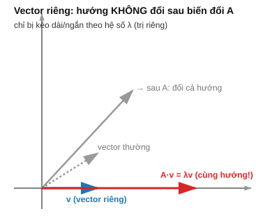

# Bài 4: Trị riêng, Vector riêng & SVD

## Mục tiêu
- Hiểu sâu ý nghĩa hình học của trị riêng/vector riêng.
- Nắm SVD như phép phân tích tổng quát nhất của 1 ma trận.
- Suy luận từng bước ra thuật toán PCA từ những khái niệm này, trước khi chạm code.

---

## PHẦN A — Ý NGHĨA TOÁN HỌC

### 1. Vector riêng (Eigenvector) — "hướng bất biến" của 1 phép biến đổi

Nhắc lại từ [Bài 3 mục 1](./3_linear_algebra_matrices.md): ma trận vuông $A$ là 1 phép biến đổi không gian. Khi áp dụng lên hầu hết vector, cả **hướng lẫn độ dài** đều thay đổi. Nhưng với MỘT SỐ vector đặc biệt, phép biến đổi $A$ chỉ làm chúng **dài ra/ngắn lại** mà KHÔNG đổi hướng — đó là **vector riêng**:

$$A\vec{v} = \lambda\vec{v}$$

$\lambda$ (**trị riêng**) là hệ số co giãn dọc theo hướng bất biến đó.



**Ví dụ tính tay:** $A=\begin{bmatrix}2&0\\0&3\end{bmatrix}$. Với $\vec{v}=[1,0]$: $A\vec{v}=[2,0]=2\times[1,0]$ — đúng là vector riêng với $\lambda=2$. Với $\vec{v}=[0,1]$: $A\vec{v}=[0,3]=3\times[0,1]$ — vector riêng với $\lambda=3$. Với ma trận đường chéo, các trục tọa độ LUÔN là vector riêng — dễ thấy ngay từ định nghĩa phép nhân ma trận ([Bài 3 mục 2](./3_linear_algebra_matrices.md)).

**Cách tìm trị riêng bằng tay (tổng quát):** từ $A\vec{v}=\lambda\vec{v} \Rightarrow (A-\lambda I)\vec{v}=\vec{0}$. Để có nghiệm $\vec{v}\neq\vec{0}$, ma trận $(A-\lambda I)$ phải suy biến ([Bài 3 mục 3-4](./3_linear_algebra_matrices.md)) — nghĩa là $\det(A-\lambda I)=0$ (gọi là **phương trình đặc trưng**). Với $A=\begin{bmatrix}4&1\\2&3\end{bmatrix}$:

$$\det\begin{bmatrix}4-\lambda&1\\2&3-\lambda\end{bmatrix} = (4-\lambda)(3-\lambda)-2 = \lambda^2-7\lambda+10=0$$

Giải ra $\lambda=5$ hoặc $\lambda=2$ (dùng công thức nghiệm phương trình bậc 2 quen thuộc).

### 2. Chéo hóa ma trận — viết lại $A$ dưới dạng "dễ hiểu" hơn

Nếu $A$ có đủ $n$ vector riêng độc lập tuyến tính ([Bài 2 mục 7](./2_linear_algebra_vectors.md)), ta có thể viết:

$$A = V\Lambda V^{-1}$$

trong đó $V$ có các cột là vector riêng, $\Lambda$ là ma trận đường chéo chứa trị riêng tương ứng. **Ý nghĩa:** phép biến đổi phức tạp $A$ thực chất là "đổi sang hệ trục tọa độ theo hướng các vector riêng ($V^{-1}$), co giãn đơn giản dọc mỗi trục ($\Lambda$), rồi đổi ngược lại hệ trục gốc ($V$)". Đây là lý do vector riêng/trị riêng "tiết lộ" bản chất đơn giản ẩn giấu sau vẻ ngoài phức tạp của ma trận $A$.

### 3. Ma trận đối xứng & Positive Semi-Definite — trường hợp đặc biệt quan trọng cho ML

Ma trận **hiệp phương sai (covariance matrix)** — nền tảng của PCA — luôn **đối xứng** ($A=A^T$) và **xác định dương (PSD)**: $\vec{x}^TA\vec{x}\geq 0$ với mọi $\vec{x}$.

**Vì sao tính chất này quan trọng?** Với ma trận đối xứng, có 1 định lý đẹp (Spectral Theorem): **mọi trị riêng đều là số THỰC** (không có số phức, dù về lý thuyết ma trận bất kỳ có thể có trị riêng phức) và **các vector riêng luôn có thể chọn VUÔNG GÓC với nhau** (trực giao). Nhờ đó, "hệ trục tọa độ mới" theo vector riêng ở mục 2 luôn là 1 hệ trục vuông góc hợp lệ — giống hệ trục Oxyz quen thuộc, chỉ xoay đi 1 góc — đây chính là điều kiện cần để PCA (mục 6) "diễn giải được" theo nghĩa hình học thông thường.

### 4. SVD — phân tích TỔNG QUÁT hơn, áp dụng được cho MỌI ma trận (kể cả không vuông)

Eigendecomposition (mục 2) chỉ áp dụng được cho ma trận vuông và có đủ vector riêng độc lập. SVD tổng quát hóa ý tưởng "co giãn theo hướng đặc biệt" cho MỌI ma trận $A \in \mathbb{R}^{m\times n}$ bất kỳ:

$$A = U\Sigma V^T$$

**Ý nghĩa hình học:** bất kỳ phép biến đổi tuyến tính nào cũng có thể phân rã thành 3 bước liên tiếp — (1) **xoay** không gian đầu vào theo $V^T$, (2) **co giãn đơn giản** dọc các trục theo $\Sigma$ (các **singular value** $\sigma_1\geq\sigma_2\geq...\geq0$, luôn không âm và sắp giảm dần), (3) **xoay** kết quả sang không gian đầu ra theo $U$. Vì luôn tách được thành "xoay - co giãn - xoay" cho MỌI ma trận, SVD tổng quát và mạnh hơn eigendecomposition rất nhiều — đây là lý do nó được dùng rộng rãi trong ML (PCA, recommendation system, nén dữ liệu, giải hệ phương trình không vuông).

**Liên hệ với eigendecomposition:** singular value $\sigma_i$ của $A$ chính là căn bậc 2 của trị riêng của $A^TA$ (1 ma trận vuông, đối xứng, PSD — luôn thỏa mãn mục 3 dù $A$ ban đầu không vuông) — đây là lý do SVD "mượn" được tính chất đẹp của eigendecomposition đối xứng dù áp dụng cho ma trận bất kỳ.

### 5. Nén dữ liệu bằng SVD — vì sao chỉ giữ vài singular value lớn nhất là đủ

Vì $\sigma_1 \geq \sigma_2 \geq ... $, các thành phần đầu tiên trong phân tích SVD đóng góp **phần lớn nhất** vào việc "dựng lại" ma trận gốc — các thành phần sau (singular value nhỏ) đóng góp rất ít, thường tương ứng với nhiễu hoặc chi tiết vụn vặt. Giữ lại $k$ thành phần đầu cho ta xấp xỉ **tốt nhất có thể** (theo nghĩa sai số bình phương nhỏ nhất — Eckart–Young theorem) của $A$ với hạng (rank) $k$ — đây là cơ sở toán học của nén ảnh/dữ liệu bằng SVD.

### 6. PCA — suy luận từng bước từ ý nghĩa toán học, TRƯỚC KHI viết code

**Câu hỏi PCA trả lời:** cho dữ liệu $n$ chiều, tìm 1 số ít "hướng" mà dữ liệu **biến thiên (phương sai) nhiều nhất** — chiếu dữ liệu lên các hướng đó sẽ giữ lại nhiều thông tin nhất có thể trong khi giảm số chiều.

**Bước 1:** đưa dữ liệu về mean = 0 (trừ trung bình mỗi cột — liên hệ [Bài 9 mục 3](./9_probability_distributions.md)) — để phương sai theo mỗi hướng chỉ phụ thuộc vào "độ phân tán", không bị lệch bởi vị trí trung tâm dữ liệu.

**Bước 2:** với 1 hướng $\vec{u}$ (norm = 1 — [Bài 2 mục 4](./2_linear_algebra_vectors.md)), phương sai của dữ liệu khi chiếu lên hướng đó là $\vec{u}^T\Sigma_{data}\vec{u}$, với $\Sigma_{data}$ là ma trận hiệp phương sai của dữ liệu ([Bài 9 mục 5](./9_probability_distributions.md)). Ta muốn tìm $\vec{u}$ tối đa hóa biểu thức này — đây chính xác là **dạng toàn phương** đã nhắc ở [Bài 6 mục 2](./6_calculus_matrix_calculus.md).

**Bước 3:** vì $\Sigma_{data}$ đối xứng & PSD (mục 3), định lý đại số tuyến tính cho biết: hướng $\vec{u}$ tối đa hóa $\vec{u}^T\Sigma_{data}\vec{u}$ (với ràng buộc $\|\vec{u}\|=1$) chính là **vector riêng ứng với trị riêng LỚN NHẤT** của $\Sigma_{data}$ — và giá trị phương sai tối đa đạt được CHÍNH LÀ trị riêng đó.

**Bước 4:** muốn giữ $k$ chiều "quan trọng nhất", chọn $k$ vector riêng ứng với $k$ trị riêng lớn nhất — đây là toàn bộ thuật toán PCA, giờ bạn đã hiểu **vì sao** nó dùng trị riêng/vector riêng của ma trận hiệp phương sai, không phải chỉ "làm theo công thức".

**Tỷ lệ phương sai giải thích được (explained variance ratio):** $\frac{\lambda_i}{\sum_j\lambda_j}$ — tỷ lệ trị riêng đã chọn so với tổng mọi trị riêng, cho biết giữ lại bao nhiêu % thông tin (phương sai) sau khi giảm chiều.

---

## PHẦN B — Cài đặt & Minh họa bằng code

```python
import numpy as np

# Mục 1: trị riêng/vector riêng — verify tính tay
A = np.array([[4, 1], [2, 3]])
eigenvalues, eigenvectors = np.linalg.eig(A)
print("Trị riêng:", eigenvalues)  # [5. 2.] — khớp tính tay (lambda^2 - 7lambda + 10 = 0)

v = eigenvectors[:, 0]
lam = eigenvalues[0]
print(A @ v)      # phải xấp xỉ lam * v
print(lam * v)

# Mục 4: SVD cho ma trận KHÔNG vuông
A2 = np.array([[3, 1], [1, 3], [0, 2]])  # 3x2
U, S, Vt = np.linalg.svd(A2)
print("Singular values:", S)
Sigma = np.zeros((3, 2))
np.fill_diagonal(Sigma, S)
print(np.allclose(A2, U @ Sigma @ Vt))  # True — verify công thức A = U*Sigma*V^T

# Mục 5: nén dữ liệu — chỉ giữ k singular value lớn nhất
def low_rank_approx(A, k):
	U, S, Vt = np.linalg.svd(A, full_matrices=False)
	return U[:, :k] @ np.diag(S[:k]) @ Vt[:k, :]

A_big = np.random.rand(100, 50)
A_compressed = low_rank_approx(A_big, k=10)
print(f"Sai số nén: {np.linalg.norm(A_big - A_compressed):.4f}")

# Mục 6: PCA — cài đặt ĐÚNG theo 4 bước suy luận ở Phần A
def pca_manual(X, n_components):
	X_centered = X - X.mean(axis=0)                    # Bước 1
	cov_matrix = np.cov(X_centered.T)                    # ma trận hiệp phương sai (Bài 9 mục 5)
	eigenvalues, eigenvectors = np.linalg.eig(cov_matrix)  # Bước 3: tìm vector riêng
	idx = np.argsort(eigenvalues)[::-1]                    # sắp trị riêng giảm dần
	top_k_vectors = eigenvectors[:, idx[:n_components]]      # Bước 4: chọn k vector riêng lớn nhất
	X_reduced = X_centered @ top_k_vectors                    # chiếu dữ liệu lên các hướng đã chọn
	explained_ratio = eigenvalues[idx[:n_components]] / eigenvalues.sum()
	return X_reduced, explained_ratio

from sklearn.datasets import load_iris
data = load_iris()
X_reduced, ratio = pca_manual(data.data, n_components=2)
print("Shape sau PCA:", X_reduced.shape)  # (150, 2) — từ 4 chiều xuống 2 chiều
print("Tỷ lệ phương sai giữ lại:", ratio)
```

## Bài tập

1. **Trị riêng bằng tay**: giải phương trình đặc trưng $\det(A-\lambda I)=0$ bằng tay cho $A=\begin{bmatrix}5&2\\2&2\end{bmatrix}$ (ma trận đối xứng — nên trị riêng chắc chắn là số thực, kiểm tra lại tính chất này), verify bằng `np.linalg.eig`.
2. **Kiểm tra tính trực giao của vector riêng ma trận đối xứng**: với ma trận ở bài 1, tính dot product ([Bài 2 mục 3](./2_linear_algebra_vectors.md)) giữa 2 vector riêng — verify nó xấp xỉ 0 (vuông góc), đúng như tính chất đã nêu ở mục 3.
3. **SVD & nén dữ liệu**: thử nén 1 ma trận ngẫu nhiên 50×50 với $k=5,10,20$, vẽ đồ thị sai số nén giảm dần theo $k$ (liên hệ [Bài 13](./13_data_visualization_eda.md)).
4. **PCA thủ công vs scikit-learn**: verify `pca_manual` cho kết quả gần giống `sklearn.decomposition.PCA` trên dataset Iris (có thể lệch dấu do vector riêng không duy nhất về hướng — giải thích tại sao điều này vẫn đúng về mặt toán học).

## Tổng kết phần Đại số tuyến tính
Bạn đã nắm vector, ma trận (như phép biến đổi không gian), trị riêng/SVD — đủ nền để hiểu cách dữ liệu được biểu diễn và biến đổi trong mọi thuật toán ML, và tự suy luận ra được thuật toán PCA từ gốc rễ toán học thay vì học thuộc công thức. Tiếp theo là Giải tích — công cụ giúp model "học" từ dữ liệu.

## Tiếp theo
→ [Bài 5: Đạo hàm & Gradient](./5_calculus_derivatives.md)
