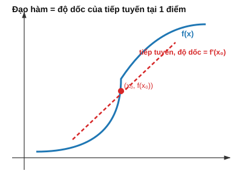

# Bài 5: Đạo hàm & Gradient

## Mục tiêu
- Hiểu bản chất đạo hàm là gì trước khi nhớ công thức.
- Nắm chain rule, đạo hàm riêng, gradient — kèm chứng minh/trực giác đầy đủ.
- Hiểu vì sao gradient là "kim chỉ nam" để model học, TRƯỚC KHI viết dòng code đầu tiên.

---

## PHẦN A — Ý NGHĨA TOÁN HỌC

### 1. Đạo hàm là gì? — xây dựng từ trực giác "tốc độ thay đổi"

Giả sử $f(x)$ mô tả quãng đường đi được theo thời gian $x$. Tốc độ **trung bình** trong khoảng $[x, x+h]$ là:

$$\frac{f(x+h)-f(x)}{h}$$

Đây chỉ là độ dốc của đường thẳng nối 2 điểm $(x, f(x))$ và $(x+h, f(x+h))$ trên đồ thị — **không phải** tốc độ tại chính xác thời điểm $x$. Để có tốc độ **tức thời**, ta thu hẹp khoảng $h$ lại gần 0 nhất có thể — đó chính là định nghĩa đạo hàm:

$$f'(x) = \lim_{h \to 0} \frac{f(x+h) - f(x)}{h}$$



**Ý nghĩa hình học:** khi $h\to 0$, đường thẳng nối 2 điểm ngày càng "ép sát" vào đường cong tại điểm $x$, trở thành đường **tiếp tuyến** — $f'(x)$ chính là **độ dốc (slope)** của tiếp tuyến đó. Độ dốc dương nghĩa là hàm đang tăng, độ dốc âm nghĩa là hàm đang giảm, độ dốc càng lớn (trị tuyệt đối) nghĩa là hàm thay đổi càng nhanh tại điểm đó.

**Ví dụ tính tay bằng định nghĩa** (không dùng công thức đạo hàm có sẵn — để thấy rõ định nghĩa hoạt động thế nào): $f(x)=x^2$ tại $x=3$.
$$f'(3) = \lim_{h\to0}\frac{(3+h)^2-3^2}{h} = \lim_{h\to0}\frac{9+6h+h^2-9}{h} = \lim_{h\to0}(6+h) = 6$$
Khớp với công thức quen thuộc $f'(x)=2x \Rightarrow f'(3)=6$.

### 2. Vì sao ML cần đạo hàm?

Trong ML, "học" nghĩa là điều chỉnh tham số $w$ của model để hàm loss $L(w)$ càng nhỏ càng tốt. Câu hỏi cốt lõi: "nếu tăng $w$ lên 1 chút, loss tăng hay giảm, và tăng/giảm nhanh cỡ nào?" — đây CHÍNH XÁC là câu hỏi mà đạo hàm $L'(w)$ trả lời. Không có đạo hàm, ta chỉ có thể "dò" $w$ một cách mù quáng (thử ngẫu nhiên); có đạo hàm, ta biết chính xác **hướng nào** làm loss giảm.

### 3. Các quy tắc đạo hàm cơ bản — và vì sao chúng đúng (trực giác, không chứng minh đầy đủ)

| Hàm | Đạo hàm | Trực giác |
|---|---|---|
| $f(x)=c$ | $0$ | hằng số không đổi → tốc độ thay đổi = 0 |
| $f(x)=x^n$ | $nx^{n-1}$ | quy tắc lũy thừa (chứng minh bằng khai triển nhị thức Newton như ví dụ mục 1) |
| $f(x)=e^x$ | $e^x$ | hàm mũ tự nhiên "tự tái tạo" — tốc độ tăng đúng bằng giá trị hiện tại |
| $f(x)=\ln x$ | $1/x$ | hàm ngược của $e^x$, tốc độ tăng chậm dần khi $x$ lớn |

**Quy tắc cộng:** $(f+g)'=f'+g'$ — tốc độ thay đổi của tổng bằng tổng tốc độ thay đổi từng phần (trực giác: nếu 2 người cùng đi thêm quãng đường, tổng quãng đường tăng thêm = quãng đường người 1 đi thêm + quãng đường người 2 đi thêm).

**Quy tắc tích:** $(fg)'=f'g+fg'$ — hình dung $f,g$ là 2 cạnh hình chữ nhật, diện tích $fg$ thay đổi do CẢ 2 cạnh cùng thay đổi 1 chút, nên có 2 số hạng.

### 4. Chain Rule — quy tắc quan trọng NHẤT đối với ML

Nếu $y=f(g(x))$ (hàm hợp — áp dụng $g$ trước, rồi $f$ lên kết quả), thì:

$$\frac{dy}{dx} = f'(g(x)) \cdot g'(x) \qquad\text{hay viết theo Leibniz: } \frac{dy}{dx}=\frac{dy}{du}\cdot\frac{du}{dx} \, (u=g(x))$$

**Trực giác:** nếu $x$ thay đổi 1 chút làm $u=g(x)$ thay đổi theo tỷ lệ $g'(x)$, và $u$ thay đổi 1 chút làm $y=f(u)$ thay đổi theo tỷ lệ $f'(u)$, thì tổng hợp lại, $x$ thay đổi làm $y$ thay đổi theo tỷ lệ **tích của 2 tỷ lệ đó** — giống như "tỷ giá hối đoái nối tiếp": 1 USD = 2 GBP, 1 GBP = 3 EUR, vậy 1 USD = 2×3 = 6 EUR.

**Ví dụ tính tay:** $y=(3x+1)^2$. Đặt $u=3x+1 \Rightarrow y=u^2$. $\frac{dy}{du}=2u$, $\frac{du}{dx}=3$. Vậy $\frac{dy}{dx}=2u\times3=6(3x+1)=18x+6$.

**Verify bằng cách khai triển trực tiếp** (để tin tưởng chain rule): $y=(3x+1)^2=9x^2+6x+1 \Rightarrow y'=18x+6$ — khớp!

**Vì sao chain rule là "trái tim" của Deep Learning?** Mạng neural là 1 hàm hợp RẤT SÂU: input đi qua lớp 1, kết quả đi tiếp qua lớp 2, rồi lớp 3... Để biết loss thay đổi thế nào khi chỉnh 1 trọng số ở lớp ĐẦU TIÊN, ta phải "truyền" ảnh hưởng đó qua TẤT CẢ các lớp ở giữa — chain rule chính là công cụ toán học duy nhất làm được việc này 1 cách có hệ thống. Đây là nền tảng của thuật toán Backpropagation ([Bài 21](./21_backpropagation.md)), và sẽ được mở rộng cho hàm nhiều biến/vector ở [Bài 6](./6_calculus_matrix_calculus.md).

### 5. Đạo hàm riêng (Partial Derivative) — mở rộng cho hàm nhiều biến

Với $f(x,y)$, đạo hàm riêng theo $x$ (ký hiệu $\partial f/\partial x$) trả lời: "nếu CHỈ $x$ thay đổi (giữ $y$ cố định), $f$ thay đổi tốc độ bao nhiêu?" — về mặt tính toán, chỉ cần áp dụng quy tắc đạo hàm bình thường, coi các biến khác như hằng số.

**Ví dụ tính tay:** $f(x,y)=x^2y+3y^2$.
- Coi $y$ là hằng số, đạo hàm theo $x$: $\frac{\partial f}{\partial x}=2xy$ (vì $3y^2$ là hằng số theo $x$, đạo hàm = 0).
- Coi $x$ là hằng số, đạo hàm theo $y$: $\frac{\partial f}{\partial y}=x^2+6y$.

Tại điểm $(x,y)=(2,3)$: $\frac{\partial f}{\partial x}=2\times2\times3=12$, $\frac{\partial f}{\partial y}=2^2+6\times3=4+18=22$.

### 6. Gradient — "kim chỉ nam" của việc học

Gộp mọi đạo hàm riêng thành 1 vector ([Bài 2](./2_linear_algebra_vectors.md)):

$$\nabla f = \begin{bmatrix}\partial f/\partial x_1\\\vdots\\\partial f/\partial x_n\end{bmatrix}$$

**Định lý quan trọng nhất cần nhớ (và hiểu tại sao):** $\nabla f$ tại 1 điểm chỉ **hướng mà $f$ tăng NHANH NHẤT** nếu ta di chuyển 1 khoảng rất nhỏ từ điểm đó.

**Vì sao?** Với 1 hướng di chuyển bất kỳ $\vec{u}$ (norm = 1), tốc độ thay đổi của $f$ theo hướng đó (gọi là **đạo hàm theo hướng**) bằng $\nabla f \cdot \vec{u}$ — chính là dot product ([Bài 2 mục 3](./2_linear_algebra_vectors.md))! Mà $\nabla f \cdot \vec{u} = \|\nabla f\|\|\vec{u}\|\cos\theta = \|\nabla f\|\cos\theta$ (vì $\|\vec{u}\|=1$) — biểu thức này đạt **giá trị lớn nhất** khi $\cos\theta=1$, tức khi $\vec{u}$ **cùng hướng** với $\nabla f$ (đúng như đã học ở [Bài 2 mục 3](./2_linear_algebra_vectors.md) về ý nghĩa của dot product). Vậy: di chuyển theo đúng hướng $\nabla f$ làm $f$ tăng nhanh nhất; ngược lại, di chuyển theo hướng $-\nabla f$ làm $f$ **giảm nhanh nhất**.

**Đây chính là lý do Gradient Descent hoạt động** ([Bài 11](./11_discrete_math_optimization.md)): để giảm hàm loss nhanh nhất, ta cập nhật tham số theo hướng $-\nabla L$.

---

## PHẦN B — Cài đặt & Minh họa bằng code

```python
import numpy as np

def numerical_derivative(f, x, h=1e-5):
	"""Xấp xỉ đạo hàm bằng định nghĩa giới hạn (finite difference) — verify công thức tay."""
	return (f(x + h) - f(x - h)) / (2 * h)

# Mục 1: verify f'(3)=6 cho f(x)=x^2
f = lambda x: x**2
print(numerical_derivative(f, 3))  # xấp xỉ 6.0

# Mục 4: verify chain rule cho y=(3x+1)^2
y = lambda x: (3*x + 1)**2
print(numerical_derivative(y, 2))  # xấp xỉ 6*(3*2+1) = 42

# Mục 5: đạo hàm riêng — verify tính tay
def f_xy(x, y):
	return x**2 * y + 3 * y**2

def partial_x(f, x, y, h=1e-5):
	return (f(x + h, y) - f(x - h, y)) / (2 * h)

def partial_y(f, x, y, h=1e-5):
	return (f(x, y + h) - f(x, y - h)) / (2 * h)

print(partial_x(f_xy, 2, 3))  # xấp xỉ 12
print(partial_y(f_xy, 2, 3))  # xấp xỉ 22

# Mục 6: gradient cho hàm nhiều biến
def gradient(f, point, h=1e-5):
	grad = np.zeros_like(point, dtype=float)
	for i in range(len(point)):
		point_plus = point.copy(); point_plus[i] += h
		point_minus = point.copy(); point_minus[i] -= h
		grad[i] = (f(point_plus) - f(point_minus)) / (2 * h)
	return grad

f_bowl = lambda p: p[0]**2 + p[1]**2  # hàm "bát úp", cực tiểu tại (0,0)
print(gradient(f_bowl, np.array([3.0, 4.0])))  # xấp xỉ [6, 8] = [2x, 2y] tại (3,4)
```

**Minh họa: "học" bằng cách đi ngược chiều gradient** (xem trước ý tưởng Gradient Descent, chi tiết đầy đủ ở [Bài 11](./11_discrete_math_optimization.md)):

```python
def loss(w):
	return (w - 5)**2  # cực tiểu tại w=5

def gradient_descent_demo(start_w, learning_rate=0.1, steps=20):
	w = start_w
	history = [w]
	for _ in range(steps):
		grad = numerical_derivative(loss, w)
		w = w - learning_rate * grad  # di chuyển NGƯỢC chiều gradient
		history.append(w)
	return history

history = gradient_descent_demo(start_w=0.0)
print("w hội tụ về:", history[-1])  # tiến dần về 5
```

## Bài tập

1. **Đạo hàm bằng định nghĩa giới hạn**: tự tính tay bằng định nghĩa (như ví dụ mục 1, KHÔNG dùng công thức có sẵn) đạo hàm của $f(x)=x^3$ tại $x=2$, verify bằng `numerical_derivative`.
2. **Chain rule**: tính tay đạo hàm của $h(x)=\ln(x^2+1)$ bằng chain rule (đặt $u=x^2+1$), verify bằng code.
3. **Gradient & hướng tăng nhanh nhất**: với $f(x,y)=(x-2)^2+(y-3)^2$, tính $\nabla f$ tại $(0,0)$ bằng tay, giải thích bằng lời (dựa vào lập luận dot product ở mục 6) tại sao di chuyển theo $-\nabla f$ đưa điểm lại gần cực tiểu $(2,3)$ hơn.
4. **Mở rộng Gradient Descent 2 biến**: mở rộng `gradient_descent_demo` cho $f(x,y)=(x-2)^2+(y-3)^2$, in quỹ đạo hội tụ về $(2,3)$.

## Tiếp theo
→ [Bài 6: Đạo hàm ma trận & Chain Rule (nền tảng Backpropagation)](./6_calculus_matrix_calculus.md)
