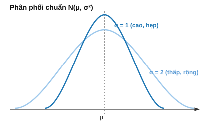

# Bài 9: Biến ngẫu nhiên & Phân phối xác suất

## Mục tiêu
- Hiểu bản chất kỳ vọng, phương sai, hiệp phương sai từ trực giác trước khi dùng công thức.
- Nắm ý nghĩa các phân phối quan trọng, đặc biệt TẠI SAO Normal quan trọng bậc nhất trong ML.

---

## PHẦN A — Ý NGHĨA TOÁN HỌC

### 1. Biến ngẫu nhiên & PMF/PDF/CDF

Biến ngẫu nhiên $X$ gán 1 con số cho mỗi kết quả ngẫu nhiên. Với biến **rời rạc**, PMF $P(X=x)$ cho biết xác suất TẠI CHÍNH XÁC giá trị $x$. Với biến **liên tục**, không thể hỏi "xác suất tại đúng 1 điểm" (luôn bằng 0 — vì có vô hạn điểm trong 1 khoảng, mỗi điểm "chiếm" 1 phần vô cùng nhỏ của tổng xác suất) — thay vào đó dùng **mật độ xác suất (PDF)** $f(x)$, và chỉ hỏi xác suất trong 1 KHOẢNG:

$$P(a\leq X\leq b) = \int_a^b f(x)\,dx$$

**Trực giác PDF:** $f(x)$ không phải là xác suất, mà là "mật độ" — giống như khối lượng riêng của vật chất: ở đâu $f(x)$ cao, xác suất "tập trung dày đặc" quanh đó hơn, dù xác suất tại 1 điểm cụ thể vẫn là 0. **CDF** $F(x)=P(X\leq x)$ dùng được cho cả 2 loại biến — là "diện tích lũy dồn" dưới đường cong PDF tính từ $-\infty$ tới $x$.

### 2. Kỳ vọng — "giá trị trung bình lý thuyết nếu lặp lại vô hạn lần"

$$E[X] = \sum_xx\cdot P(X=x) \quad\text{(rời rạc)}$$

**Trực giác:** không phải trung bình cộng đơn giản của các giá trị CÓ THỂ, mà là trung bình **có trọng số theo xác suất** — giá trị nào xảy ra thường xuyên hơn (xác suất cao hơn) đóng góp nhiều hơn vào kỳ vọng.

**Ví dụ tính tay:** tung xúc xắc, mỗi mặt xác suất $1/6$. $E[X]=1\times\frac16+2\times\frac16+...+6\times\frac16=\frac{1+2+...+6}{6}=\frac{21}{6}=3.5$ — chú ý $3.5$ không phải giá trị nào xúc xắc thực sự ra được, nhưng là "trung bình" nếu tung rất nhiều lần.

**Tính chất tuyến tính** (dùng RẤT nhiều trong ML để đơn giản hóa tính toán): $E[aX+bY]=aE[X]+bE[Y]$ — đúng dù $X,Y$ có độc lập hay không. Trực giác: kỳ vọng của tổng các "hiệu ứng" bằng tổng kỳ vọng từng hiệu ứng riêng lẻ, không quan tâm chúng có ảnh hưởng lẫn nhau hay không.

### 3. Phương sai — đo độ "phân tán" quanh kỳ vọng

$$\text{Var}(X) = E[(X-E[X])^2]$$

**Vì sao bình phương độ lệch, không lấy trị tuyệt đối?** Bình phương làm cho hàm khả vi trơn tru mọi nơi (trị tuyệt đối có "góc nhọn" tại 0 — liên hệ lại L1 norm ở [Bài 2 mục 4](./2_linear_algebra_vectors.md)), thuận tiện cho việc lấy đạo hàm khi tối ưu ([Bài 5-7](./5_calculus_derivatives.md)); đồng thời phạt các độ lệch LỚN nặng hơn nhiều so với độ lệch nhỏ (độ lệch gấp đôi → đóng góp vào phương sai gấp 4).

**Công thức tính nhanh** (suy ra bằng khai triển bình phương, dùng tính tuyến tính kỳ vọng ở mục 2): $\text{Var}(X)=E[X^2]-(E[X])^2$ — thường dễ tính hơn công thức gốc vì không cần biết $E[X]$ trước khi tính từng độ lệch.

**Ứng dụng ML trực tiếp:** phương sai là lý do ta **chuẩn hóa dữ liệu (standardization)** $z=\frac{x-\mu}{\sigma}$ trước khi huấn luyện nhiều model — đưa mọi đặc trưng về "cùng thang đo phân tán", tránh đặc trưng có phương sai lớn (thang đo lớn, vd giá nhà tính bằng đồng) "át" đặc trưng có phương sai nhỏ (vd số phòng) chỉ vì đơn vị đo khác nhau, không phải vì nó thực sự quan trọng hơn.

### 4. Hiệp phương sai — đo mức độ 2 biến "biến thiên cùng nhau"

$$\text{Cov}(X,Y) = E[(X-E[X])(Y-E[Y])]$$

**Trực giác dấu:** nếu $X$ trên trung bình thường đi kèm $Y$ CŨNG trên trung bình (và ngược lại cùng dưới trung bình), tích $(X-E[X])(Y-E[Y])$ thường DƯƠNG (dương×dương hoặc âm×âm) → covariance dương. Nếu $X$ trên trung bình thường đi kèm $Y$ DƯỚI trung bình, tích thường ÂM → covariance âm.

**Ma trận hiệp phương sai** — gộp phương sai (đường chéo) và hiệp phương sai (ngoài đường chéo) của nhiều biến thành 1 ma trận đối xứng — chính là ma trận đã dùng để suy luận PCA ở [Bài 4 mục 6](./4_linear_algebra_eigen_svd.md): đối xứng vì $\text{Cov}(X,Y)=\text{Cov}(Y,X)$ (định nghĩa đối xứng theo $X,Y$); xác định bán dương vì $\text{Var}(\vec{a}^T\vec{X})=\vec{a}^T\Sigma\vec{a}\geq0$ với mọi tổ hợp tuyến tính $\vec{a}$ (phương sai không bao giờ âm).

### 5. Các phân phối quan trọng — và bài toán thực tế mỗi phân phối mô tả

**Bernoulli** — mô hình hóa 1 sự kiện nhị phân (có/không) duy nhất: $P(X=1)=p$. Đây chính xác là mô hình xác suất đứng sau nhãn của bài toán phân loại nhị phân ([Bài 15](./15_logistic_regression.md)).

**Binomial** — số lần "thành công" trong $n$ lần thử Bernoulli ĐỘC LẬP: $P(X=k)=\binom{n}{k}p^k(1-p)^{n-k}$ — hệ số $\binom{n}{k}$ ([Bài 11 mục 1](./11_discrete_math_optimization.md)) đếm SỐ CÁCH chọn $k$ vị trí "thành công" trong $n$ lần thử, $p^k(1-p)^{n-k}$ là xác suất của 1 cách sắp xếp cụ thể (do độc lập, xác suất các lần thử NHÂN lại — [Bài 8 mục 4](./8_probability_basics.md)).

**Poisson** — số sự kiện xảy ra trong 1 khoảng thời gian/không gian cố định, khi các sự kiện xảy ra độc lập với tốc độ trung bình không đổi $\lambda$: $P(X=k)=\frac{\lambda^ke^{-\lambda}}{k!}$ — có thể xem là "giới hạn" của Binomial khi $n\to\infty$, $p\to0$ nhưng $np=\lambda$ cố định (chia khoảng thời gian thành vô số khoảng nhỏ, mỗi khoảng xác suất xảy ra sự kiện rất nhỏ).

**Uniform** — mọi giá trị trong 1 khoảng "công bằng" như nhau: $f(x)=\frac{1}{b-a}$. Dùng để khởi tạo trọng số ngẫu nhiên trong mạng neural khi không có lý do ưu tiên giá trị nào.

### 6. Phân phối Normal/Gaussian — TẠI SAO nó thống trị ML

$$f(x) = \frac{1}{\sigma\sqrt{2\pi}}e^{-\frac{(x-\mu)^2}{2\sigma^2}}$$



**Lý do 1 — Central Limit Theorem (Định lý giới hạn trung tâm):** tổng (hoặc trung bình) của RẤT NHIỀU biến ngẫu nhiên độc lập, BẤT KỂ phân phối gốc của chúng là gì, sẽ tiến gần tới phân phối Normal khi số lượng biến đủ lớn. Đây là lý do sâu xa: nhiễu đo lường trong thực tế (thường là TỔNG của rất nhiều nguồn nhiễu nhỏ, độc lập — sai số cảm biến, làm tròn, nhiễu môi trường...) gần như LUÔN tuân theo Normal — không phải trùng hợp, mà là hệ quả toán học tất yếu của việc cộng dồn nhiều nguồn ngẫu nhiên nhỏ lại.

**Lý do 2 — kết nối trực tiếp MLE và hàm loss:** giả định nhiễu Gaussian trong Linear Regression dẫn thẳng tới hàm loss MSE (chứng minh đầy đủ ở [Bài 10 mục 2](./10_statistics_inference.md)) — không phải chọn MSE vì "tiện tính toán", mà vì nó là hệ quả TẤT YẾU của giả định Gaussian.

**Lý do 3 — tính chất toán học đẹp:** tổng của các biến Gaussian độc lập VẪN là Gaussian (đóng kín dưới phép cộng); Gaussian được xác định hoàn toàn chỉ bởi 2 tham số ($\mu,\sigma$) — đơn giản để ước lượng (mục 2-3) và suy luận.

---

## PHẦN B — Cài đặt & Minh họa bằng code

```python
import numpy as np
from scipy import stats

# Mục 1: PDF/CDF
x = 1.5
print(stats.norm.pdf(x, loc=0, scale=1))  # giá trị "mật độ" — KHÔNG phải xác suất
print(stats.norm.cdf(x, loc=0, scale=1))  # P(X <= 1.5) — xác suất thật sự

# Mục 2: verify kỳ vọng bằng tay
values = np.array([1,2,3,4,5,6])
probs = np.array([1/6]*6)
print(np.sum(values * probs))  # 3.5 — khớp tính tay

# Mục 3: phương sai & 2 công thức phải khớp nhau
data = np.array([2,4,4,4,5,5,7,9])
print(np.var(data))                                 # công thức trực tiếp
print(np.mean(data**2) - np.mean(data)**2)             # công thức "tính nhanh" — verify khớp

# Mục 4: ma trận hiệp phương sai
X = np.array([1,2,3,4,5]); Y = np.array([2,4,5,4,5])
print(np.cov(X, Y))          # đường chéo = Var(X), Var(Y); off-diagonal = Cov(X,Y)
print(np.corrcoef(X, Y)[0,1]) # hệ số tương quan chuẩn hóa, trong [-1,1]

# Mục 6: verify Central Limit Theorem bằng mô phỏng
np.random.seed(42)
sample_means = [np.mean(np.random.uniform(0, 1, size=30)) for _ in range(2000)]
print(f"Mean of sample means: {np.mean(sample_means):.4f}")  # xấp xỉ 0.5 (mean của Uniform(0,1))
# vẽ histogram của sample_means sẽ thấy hình dạng CHUÔNG dù dữ liệu gốc là Uniform (phẳng)
```

## Bài tập

1. **Kỳ vọng/phương sai bằng tay**: cho $P(X=1)=0.2,P(X=2)=0.5,P(X=3)=0.3$, tính tay $E[X]$ và $\text{Var}(X)$ (dùng cả 2 công thức ở mục 3 để verify chúng khớp nhau), rồi kiểm tra bằng code.
2. **Covariance & correlation**: tự tạo 2 mảng dữ liệu có tương quan dương mạnh, âm mạnh, và gần như không tương quan; giải thích bằng lời (dựa vào trực giác dấu ở mục 4) tại sao dấu của covariance lại như vậy trước khi chạy code kiểm tra.
3. **So sánh hình dạng phân phối**: mô phỏng 10,000 mẫu từ Binomial, Poisson, Normal, vẽ histogram so sánh (liên hệ [Bài 13](./13_data_visualization_eda.md)).
4. **Central Limit Theorem**: verify bằng mô phỏng như code mẫu, thử với phân phối gốc RẤT lệch (vd exponential) thay vì Uniform — quan sát trung bình mẫu vẫn tiến về hình chuông.

## Tiếp theo
→ [Bài 10: Ước lượng thống kê & Kiểm định giả thuyết](./10_statistics_inference.md)
